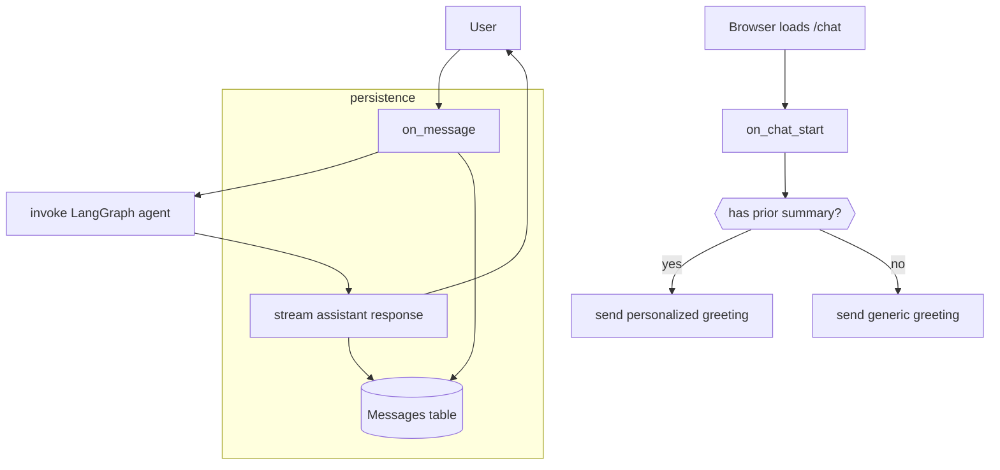

# Plan: Chainlit UI & Session Management for DBT Chain Analysis Assistant

## Purpose

Develop the **front-end conversation layer** using [Chainlit](https://docs.chainlit.io) that interfaces with the LangGraph agent.  This plan covers: session lifecycle, token streaming, UI components, and message logging.  Backend agent logic & database schema are defined in separate plans.

> **Status:** _DRAFT v0.1_

---

## 1 Objectives & Acceptance Criteria

| ID | Objective | Acceptance Test |
|----|-----------|----------------|
| UI-1 | Chat UI streams assistant tokens in real-time. | Manual: observe incremental token rendering in browser |
| UI-2 | `user_session` persists `compiled_graph` & `session_id` across turns. | Add debug panel ➜ values remain identical for a given tab |
| UI-3 | On chat start, show personalized greeting using last session summary (if exists). | Unit: stub `fetch_last_summary` returns string ⇒ greeting contains that string |
| UI-4 | Messages are logged to Postgres `Messages` table. | After a turn, query table – record count += 2 |

---

## 2 Event Flow



---

## 3 File Skeletons

| File | Purpose |
|------|---------|
| `app/main.py` | Chainlit entrypoint. Contains two handler functions. |
| `app/db.py` | Async helper for Postgres connection + simple ORM wrappers. |
| `tests/test_chainlit_ui.py` | Async pytest suite w/ httpx to test handlers. |

### 3.1 `app/main.py` excerpt

```python
import chainlit as cl
from app.db import save_message, fetch_last_summary
from app.agent import compiled_graph  # built in other plan
from uuid import uuid4

@cl.on_chat_start
aasync def on_chat_start():
    user_id = cl.user_session.get("user_id") or f"guest_{uuid4()}"
    cl.user_session.set("user_id", user_id)
    session_id = f"{user_id}_{uuid4()}"
    cl.user_session.set("session_id", session_id)

    summary = await fetch_last_summary(user_id)
    greeting = (
        f"(The assistant recalls: {summary})\n\n" if summary else ""
    ) + "Hello, I'm here to help you with a DBT Chain Analysis."
    await cl.Message(content=greeting, author="assistant").send()
```

*(Full file in code appendix)*

---

## 4 Token Streaming Strategy

Chainlit streams when you produce a `cl.Message` then call `await message.stream_token(token)`.  Implement helper:

```python
async def stream_chunks(text: str):
    msg = cl.Message(content="")
    for chunk in textwrap.wrap(text, 20):  # 20-char chunks for demo
        await msg.stream_token(chunk)
    await msg.send()
```

---

## 5 Logging

```python
async def save_message(session_id: str, text: str, role: str):
    await db.execute("""
        INSERT INTO messages(session_id, role, content)
        VALUES ($1, $2, $3)
    """, session_id, role, text)
```

Call in `on_message` before/after agent invocation.

---

## 6 Testing Matrix

| Test | Steps | Expected |
|------|-------|----------|
| T-UI-1 | Simulate `/chat` GET | Websocket opens; greeting displays |
| T-UI-2 | Post message "Hi" | DB `messages` has 2 rows |
| T-UI-3 | Provide long assistant reply | Front-end streams tokens (observe via websocket logs) |

Use `pytest + chainlit test client`.

---

## 7 Open Questions

* Do we expose a **download summary** button at session end?
* Need CORS if hosting UI separately?

---

## 8 Revision Log

| Version | Date | Author | Notes |
|---------|------|--------|-------|
| 0.1 | 2024-05-XX | assistant | initial draft |
